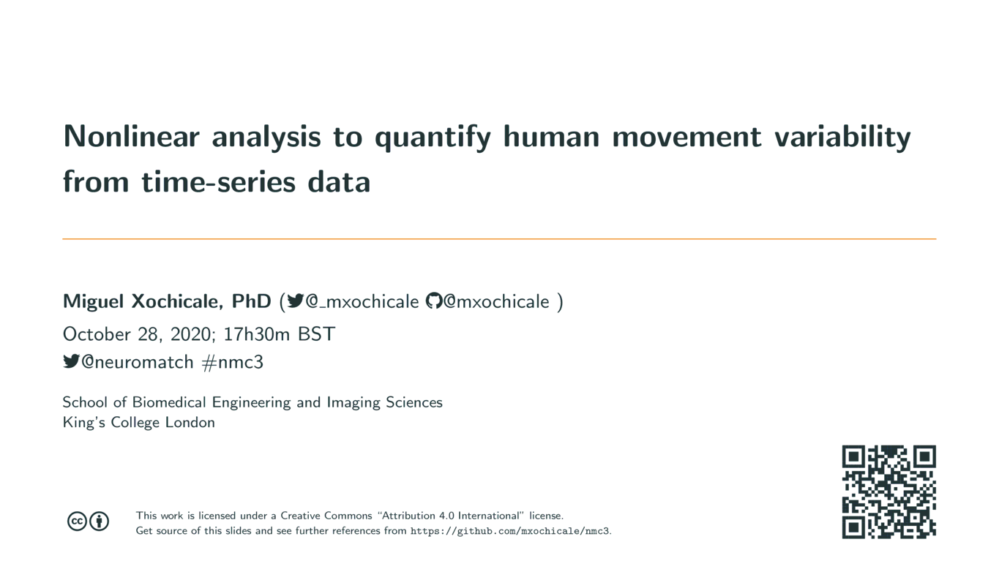

# Nonlinear analysis to quantify human movement variability from time-series data

## Abstract
The complexity of human movement arises from the management of
redundant (bio)mechanical degrees of freedom
(DOF) to successfully accomplish any given motor task (Bernstein, 1967).
Such DOF can be described in terms of (in)dependent coordinates which uniquely
describe a joint configuration of the motor system.
The joint configuration provides
flexibility and stability to allow consistent movement, 
and the management of DOF allow adaptation to changing environment conditions.
Consequently, human movement variability is always present in even
the simplest movements.
That said, this talk will touch on three points:
(a) theoretical models for human movement variability and methods to quantify human movement variability, 
(b) use of nonlinear methods to measure real-world time series
data (i.e., data affected by non-stationarity, non-linearity, data length, sensor
source, noise, etc.), and
(c) illustration of results for real-world time-series data from human-robot imitation activities.
I will then comment on current and future challenges on this subject
and how the above points might lead to development tools to evaluate, 
for instance, the improvement of movement performances, 
to quantify and provide feedback of skill learning or 
to quantify movement adaptations and pathologies.

## Slides [PDF](https://github.com/mxochicale/nmc3/blob/generated-pdfs/slides.pdf) 

## Neuromatch 3.0
Site: https://neuromatch.io/  

## Themes
Theme C: Sensory & Motor Systems, and Physiology/Behavior		
Theme E: Computation and Techniques  

## Licence and Citation 
This work is under Creative Commons Attribution-Share Alike license . Hence, you are free to reuse it and modify it as much as you want and as long as you cite this work as original reference and you re-share your work under the same terms.

## Contact 
If you have specific questions about the content of this repository, you can contact 
[Miguel Xochicale](mailto:miguel.xochicale@gmail.com?subject="[nmc3]"). 
If your question might be relevant to other people, please instead 
[open an issue](https://github.com/mxochicale/nmc3/issues).

