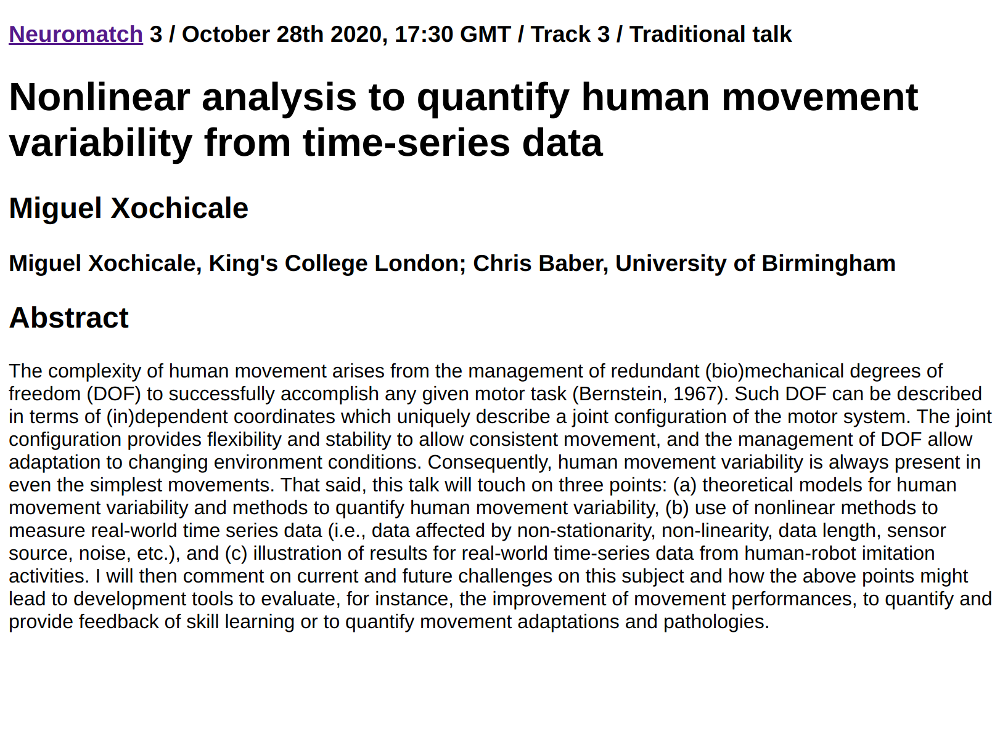

# Tweets


## 7:00 am · 26 Oct 2020
```
Really looking forward to presenting "Nonlinear analysis to quantify human movement variability from time-series data" @neuromatch #nmc3 in the Theme C: Sensory & Motor Systems, and Physiology/Behavior
Oct 28th 2020, 17:30 GMT 

😍 Exciting schedule ahead https://neural-reckoning.github.io/nmc3_provisional_schedule/
```


[tweet](https://twitter.com/_mxochicale/status/1320621276336168964)


